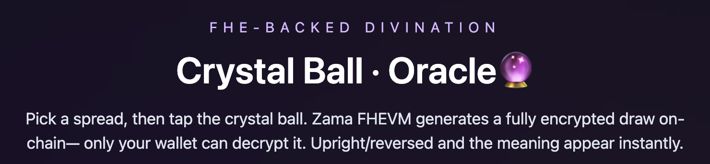
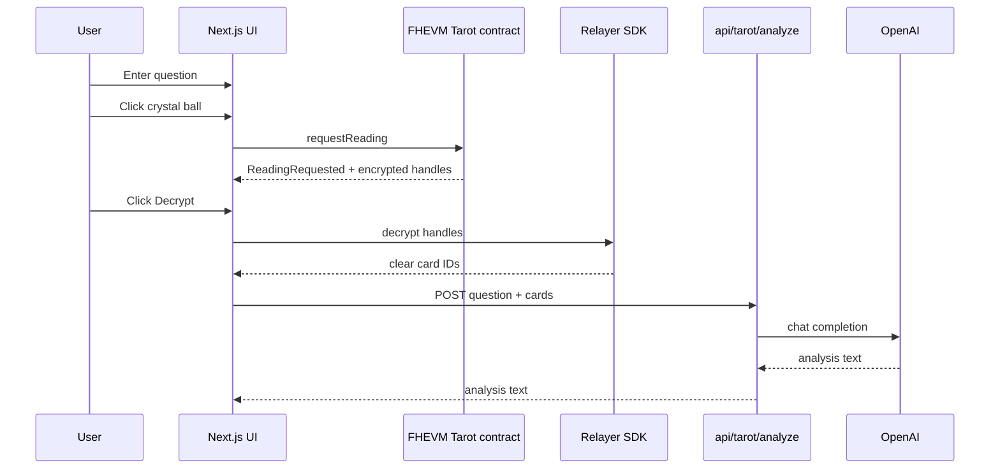

# TarotZama — FHEVM Tarot Oracle + AI Interpretation



TarotZama is a **privacy-first Tarot oracle** powered by **Zama FHEVM**.
Your cards are **drawn on-chain in encrypted form**, then **decrypted locally in your browser** — **only you can know the result**.

## Live demo

- **Try it now**: [tarotzama-nextjs.vercel.app](https://tarotzama-nextjs.vercel.app/)

## Why TarotZama

- **Zama FHE on-chain draw**: the contract stores only **ciphertexts** — no plaintext card IDs ever hit the chain.
- **Decrypt in your wallet**: clear results are revealed **client-side** via the Relayer SDK — **you and only you** see the cards.
- **Shareable experience, private truth**: stream it, screenshot it, keep it secret — the protocol doesn’t leak your reading.
- **AI interpretation**: after you decrypt, TarotZama can generate a tailored interpretation from your question + spread.

## Core promise

> **Your Tarot reading is yours alone.**  
> On-chain computation stays encrypted; the clear meaning appears only in your browser.

## Table of contents

- [Repository layout](#repository-layout)
- [Architecture](#architecture)
- [Quick start (frontend)](#quick-start-frontend)
- [Environment variables](#environment-variables)
- [Deploy the Tarot contract](#deploy-the-tarot-contract)
- [AI interpretation flow](#ai-interpretation-flow)
- [Card images (WebP)](#card-images-webp)
- [Deploy to Vercel](#deploy-to-vercel)
- [Troubleshooting](#troubleshooting)
- [License](#license)

## Repository layout

```text
tarotzama/
├── packages/
│   ├── hardhat/   # Tarot.sol + deploy scripts (localhost / sepolia)
│   └── nextjs/    # Next.js App Router frontend + FHEVM hooks + AI route
├── scripts/       # ABI/codegen helpers (used by root scripts)
└── README.md
```

## Architecture

### End-to-end sequence



## Quick start (frontend)

Install dependencies at repo root:

```bash
pnpm install
```

Create `packages/nextjs/.env.local`:

```bash
OPENAI_API_KEY=your_openai_key
```

Run the app:

```bash
pnpm start
```

Default URL: `http://localhost:3000`.

## Environment variables

### Frontend (`packages/nextjs/.env.local`)

| Variable | Required | Purpose |
| --- | --- | --- |
| `OPENAI_API_KEY` | Yes (for AI) | Server-only key used by `POST /api/tarot/analyze`. |
| `NEXT_PUBLIC_ALCHEMY_API_KEY` | Recommended | More reliable browser RPC (avoids CORS issues on some public RPCs). |
| `NEXT_PUBLIC_WALLET_CONNECT_PROJECT_ID` | Optional | WalletConnect project ID (a default exists in code). |
| `NEXT_PUBLIC_CHAIN_ID` | Optional | `11155111` (Sepolia) or `31337` (local hardhat). |

> After editing `.env.local`, restart the dev server.

### Hardhat (`packages/hardhat/.env`)

| Variable | Required | Purpose |
| --- | --- | --- |
| `MNEMONIC` | Yes | Deployer account mnemonic. |
| `INFURA_API_KEY` | Yes (current config) | Sepolia RPC via Infura URL. |

## Deploy the Tarot contract

### Sepolia

Create `packages/hardhat/.env`:

```bash
MNEMONIC="your twelve words ..."
INFURA_API_KEY="your_infura_key"
```

Deploy and generate frontend contract typings:

```bash
pnpm deploy:sepolia
```

This runs:
- deploy in `packages/hardhat`
- `pnpm generate` which regenerates ABIs/typings and updates `packages/nextjs/contracts/deployedContracts.ts`

### Local hardhat

Create `packages/hardhat/.env`:

```bash
MNEMONIC="test test test test test test test test test test test junk"
INFURA_API_KEY="unused_for_local_but_required_by_config"
```

Run a local node + deploy + generate:

   ```bash
pnpm chain
   pnpm deploy:localhost
   ```

Then set in `packages/nextjs/.env.local`:

   ```bash
NEXT_PUBLIC_CHAIN_ID=31337
```

## AI interpretation flow

- Users type a question in the input field.
- Clicking the crystal ball both **submits the question (local display)** and **requests the on-chain encrypted draw**.
- After clicking **Decrypt**, the UI calls `POST /api/tarot/analyze` and renders the response under the spread.

> `OPENAI_API_KEY` is **server-only** and never shipped to the browser.

## Card images (WebP)

Optimized card images live in:

- `packages/nextjs/public/cardpic_webp/`

To regenerate from PNG sources:

   ```bash
pnpm --filter ./packages/nextjs images:webp -- --input ./utils/cardpic --publicOut ./public/cardpic_webp --quality 60 --maxWidth 900
```

## Deploy to Vercel

- Set **Root Directory** to `packages/nextjs`.
- Ensure env vars are configured in Vercel:
  - `OPENAI_API_KEY` (required for AI)
  - `NEXT_PUBLIC_ALCHEMY_API_KEY` (recommended)
- This repo uses pnpm; `packages/nextjs/vercel.json` is configured accordingly.

## Troubleshooting

- **Stuck on “interpreting…”**: the server may not be able to reach OpenAI from your environment. The API route uses a timeout and should surface an error message; check your network/proxy and confirm `OPENAI_API_KEY` is set in the runtime.
- **RPC “Failed to fetch” in browser**: some public RPCs don’t allow browser CORS. Set `NEXT_PUBLIC_ALCHEMY_API_KEY` or add a CORS-friendly RPC override in `packages/nextjs/scaffold.config.ts`.
- **Deploy succeeded but frontend still points to old contract**: run `pnpm generate` (already included in `pnpm deploy:sepolia` / `pnpm deploy:localhost`).

## License

BSD-3-Clause-Clear. See [LICENSE](LICENSE).
